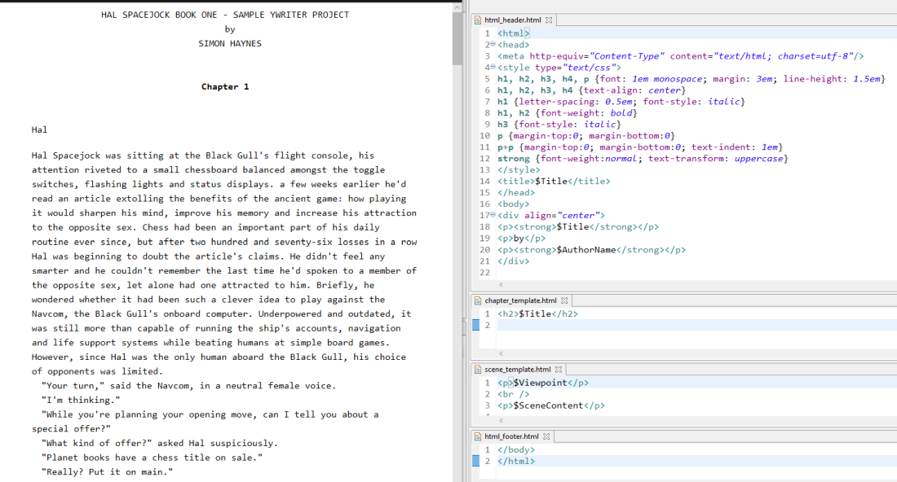

The yw2html Python script runs through all chapters and scenes of a yWriter 7 project and fills HTML templates.

## Requirements

* [Python 3](https://www.python.org). Python 3.4 or more recent will work. However, Python 3.7 or above is highly recommended.

## Download and install

[Download the latest release (version 1.4.0)](https://raw.githubusercontent.com/peter88213/yw2html/master/dist/yw2html_v1.4.0.zip)

* Unzip the downloaded zipfile "yw2html_v1.4.0.zip" into a new folder and open "README.md" for usage instructions.

[Changelog](changelog)

## Usage

See the [usage instructions](usage)

## See also

If you are looking for a simpler solution with a graphical user interface, take a look at [yw-reporter](https://peter88213.github.io/yw-reporter).

## License

yw2html is distributed under the [MIT
License](http://www.opensource.org/licenses/mit-license.php).
